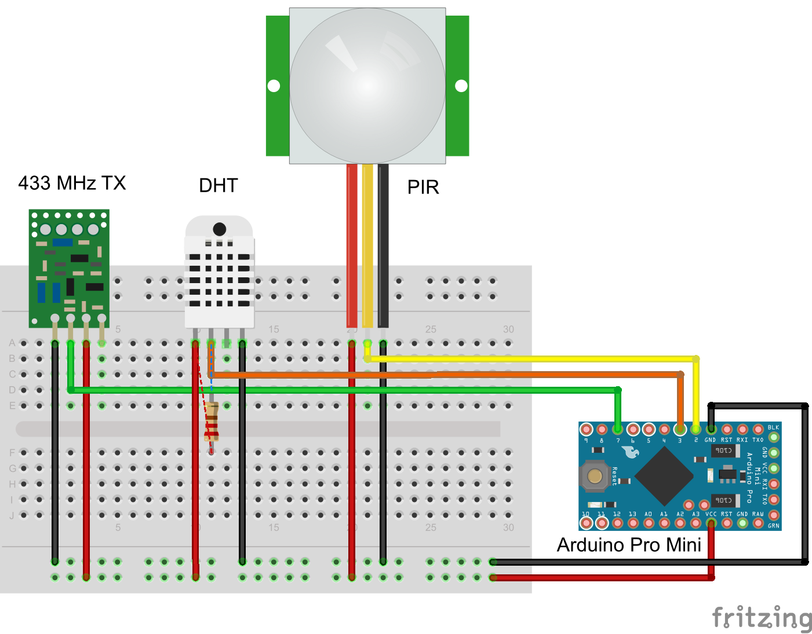
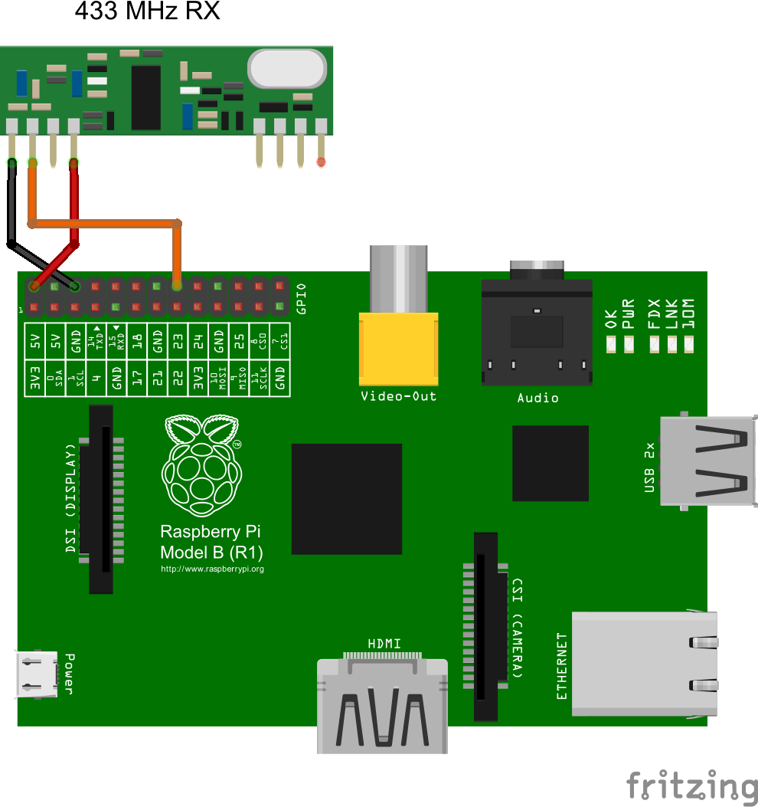

Project idea: multiple Arduinos with TX radios, each equipped with DHT and PIR sensors; they all send the data to the Raspberry Pi which posts it to the web and also writes it to a local database. In addition to the values from sensors, I am also sending the voltage level.

The comments in the code for both the sender (Arduino) and the receiver (Raspberry Pi) pretty much explain everything (how it works, how to connect the sensors and radios, and so on). More details can be found [on my blog](http://ivyco.blogspot.com/2014/09/arduino-sensors-to-raspberry-pi-using.html).

